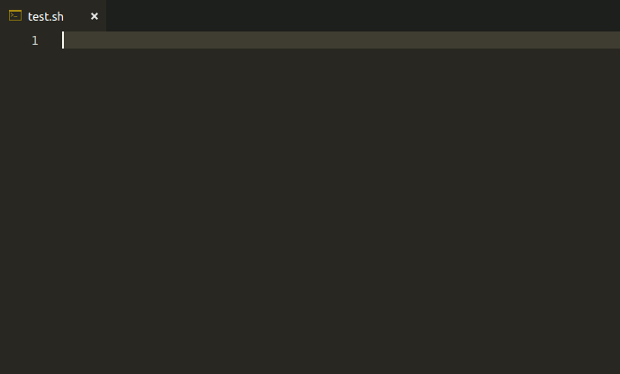
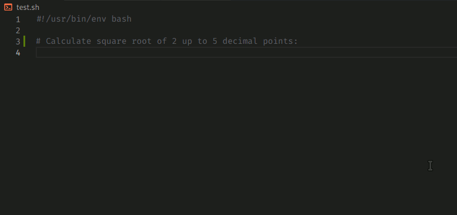
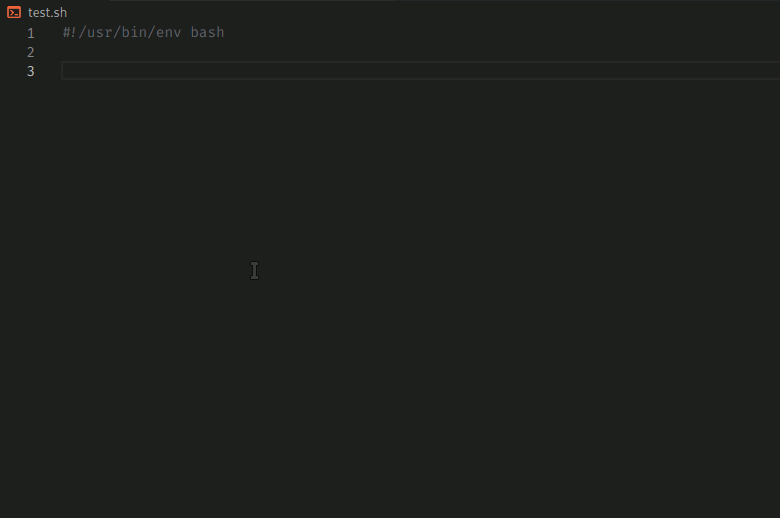

# shellman

[](https://github.com/yousefvand/shellman/release)
[](https://github.com/yousefvand/shellman/blob/master/LICENSE.md)
[](https://github.com/yousefvand/shellman/stargazers)
[](https://github.com/yousefvand/shellman/issues)
[](https://gitter.im/vscode-shellman/Lobby)


Shell script snippet

Learn Bash Scripting with Shellman, examples included. [Download](https://github.com/yousefvand/shellman-ebook) free ebook (pdf, epub, mobi).

Read [Shellman story on medium](https://medium.com/@remisa.yousefvand/shellman-reborn-f2cc948ce3fc) (3 min read).



## Math example



## `fn... / fx...` example



## Requirements

- vscode
- bashdb (If you need to debug your scripts)

## Usage

Install extension in vscode by:

```bash
ext install Remisa.shellman
```

Start typing and Shellman will provide you available commands.

For more convenience similar commands are grouped into same prefixes. Here is an overview:

`bash`

Shebang should be used as the first line of your script. You can replace `bash` with any other installed scripting language like `node` or `python`.

`argument parsing` | `parse args`

Parse command-line arguments

`cmd...`

Run external commands and check if operation succeeded.

`color...`

Write colorful

`directory...`

Directory operations

`func...`

Snippets related to function.

`for...`

Iterate different collections/arrays...

`file...`

File operations

`format...`

Write in bold, italic, dim, reverse format.

`ftp...` and `http...`

Web methods and functionalities: GET, POST...

`git...`

git commands

`if...`

Wide range of logical conditions which are more common in bash scripts.

`math...`

Math operations

`string...`

String utilities

`stopwatch...`

Start and stop, stopwatch and read elapsed time.

## `fn` / `fx`

`fn...`

inserts a whole function into script. Function declaration should proceed its usage.

`fx...`

Call function which is declared by `fn...`

## Functions

- banner simple
  - print a banner with provided title.
  - example: `banner_simple "my title"`
- banner color
  - print a color banner.
  - example: `banner_color red "my title"`
- import
  - Organize your project and reuse functions. Import functions from other shell script files. Default import directory is `lib`. This directory should be where the calling script exists and contain library files with `.sh` extension. For example if `libname.sh` contains some useful functions and exists in `lib` directory, you can import those functions into your script and call them.
  - example: `import "somefile"` will import all defined functions in `somefile.sh` from `lib` directory where calling script resides.
- scan
  - Scan host's port range (tcp/udp)

## List of [commands](COMMANDS.md)

## Release Notes

### 4.3.1

- Fixed #10 in math namespace.
- Some enhancements in math namespace.

### 4.3.0

- Process commands `process ...`
  - `list`: List all processes.
  - `id`: Get process ID by name.
  - `kill`: Kill process by name.
- `cmd renice`: Change running process priority.

### 4.2.0

- Shellman ebook available for [download](https://github.com/yousefvand/shellman-ebook).
- `math fn/fx`
  - `sum`: Calculate sum of given integers.
  - `product`: Calculate product of given integers.
  - `average`: Calculate average of given integers.

### 4.1.1

- Minor bugs fixed.
- `let` added for arithmetic operations.

### 4.0.0

- fixed issues [3](https://github.com/yousefvand/shellman/issues/3), [4](https://github.com/yousefvand/shellman/issues/4), [5](https://github.com/yousefvand/shellman/issues/5), [6](https://github.com/yousefvand/shellman/issues/6), [7](https://github.com/yousefvand/shellman/issues/7)

### 3.6.1

- Escape dollar sign

### 3.6.0

- `system...`
  - System information (CPU, Memory, Kernel...)

### 3.5.0

- `git...`
  - `git` commands.

### 3.4.0

- `ftp...`
  - `list`: Get the list of files on the ftp server at specific path.
  - `download`: Download specified file from ftp server.
  - `upload`: Upload specified file to ftp server.
  - `delete`: Delete specified file from ftp server.
  - `rename`: Rename specified file/directory on ftp server.

### 3.3.0

- `http...`
  - `GET`: Send http GET request using curl.
  - `POST`: Send data with http POST, using curl.
  - `POST file`: Send file via http POST, using curl.
  - `PUT`: Send data with http PUT, using curl
  - `DELETE`: Send http DELETE request using curl.
  - `cookie`: Send http request with cookies, using curl.
  - `header`: Send http request with protocol/custom header, using curl.
  - `download`: Download from url and save to `/path/to/file`, using curl.

### 3.2.0

- `fn/fx progress`
  - Dummy progress bar with custom message

### 3.1.0

- `nice`
  - Execute a command with desired privilege
- `archive...`
  - Compress/decompress file/directory (currently .tar.gz supported. More soon)
- `crypto...`
  - base64 encode / decode
  - Calculate hash of string using md5, sha, sha1, sha224, sha256, sha384 and sha512 algorithms

### 3.0.0

- `array...`
  - Array namespace

### 2.3.1

- `date...`, `time...`
  - Date and time commands
- `file find`
  - Find files and directories by name (wildcard supported)
- `file search`
  - Search inside all files for a text (i.e. word)

### 2.2.1

- Argument parsing
  - parse command line arguments (flags/switches)
- bug fixed (int less than)

### 2.1.0

- Documentation improved.
- `import` function (fn/fx) added.
  - Import functions from other shell script files.
- `options` function (fn/fx) added.
  - Provide a list of options to user.

### 2.0.0

- `math...`
  - math constants (π, e, Ω, ...)
  - math operations (with precision).

### 1.5.1

- `string substring` typo fixed.

### 1.5.0

- `region`: A region for specific purpose (functions, variables...)
- string manipulation
  - `string length`: length of string in characters.
  - `string trim`: remove leading and trailing white space(s).
  - `string trim left`: remove leading white space(s).
  - `string trim right`: remove trailing white space(s).
  - `string trim all`: remove all white space(s).
  - `string replace`: find all occurrences of a substrings and replace them.
  - `string reverse`: reverse string characters.
  - `string toLower`: convert string to lowercase.
  - `string toUpper`: convert string to uppercase.
  - `string substring`: part of the string from offset with [length] characters.
  - `string contains`: check whether string contains substring.
  - `string indexOf`: first index of substring in string.

### 1.4.0

- `assign array`: assign elements to an array.
- `ip ...`
  - `ips`: array of local IPs.
  - `ip info`: public ip information (country, city...).
  - `ip public`: public ip address.
- `random number`: generate random integer x such as min < x < max.
- `service manage`: manage service operations via `systemctl`.
- `timeout`: run command within a time frame. Cancel command if not finished within x seconds.
- `fn/fx`
  - `scan`: scan host's port range and find open ports (tcp/udp).

### 1.3.0

- stopwatch
- `fn...` / `fx...` whole function and usage insertion.
  - `fn banner simple`: insert function to print a banner.
  - `fn banner color`: insert function to print a color banner.

### 1.2.0

- Check last command success/failure via `cmd...`
- Directory operations via `directory...`

### 1.1.2

- Fixed vscode marketplace header color contrast

### 1.1.1

- Minor bugs fixed
- Write colorful text
- Write formatted text (bold, italic, dim, reverse)
- Snippet documentation added

### 0.0.1

Initial release
