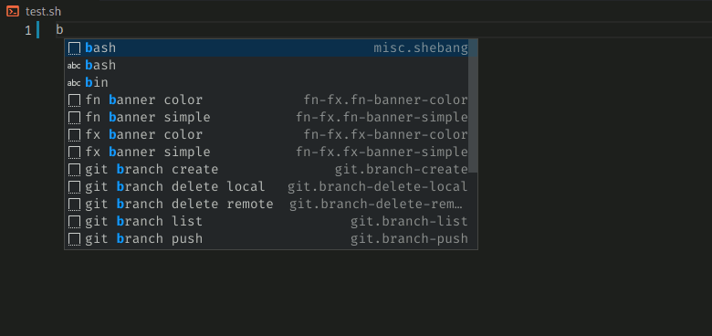

# shellman

## Shell scripting snippet

Learn easy Shell Scripting with `Shellman`, examples included. [Download](https://github.com/yousefvand/shellman-ebook) free ebook (pdf, epub, mobi). Reading the `Basics` part of the book is strongly recommended if you are new to `Shell Scripting`.

Read [Shellman story on medium](https://medium.com/@remisa.yousefvand/shellman-reborn-f2cc948ce3fc) (3 min read).

Instead of language specific syntax, here `Shell Scripting`, `Shellman` focuses on programming concepts. These concepts are grouped under `namespaces`. For example `string` namespace to name a few contains:

- concat
- length
- reverse
- toLower
- toUpper
- trim
- ...

to activate desired `snippet` you need to type `string` and select desired `snippet` from listed `snippets` i.e. `string reverse`. Using <kbd>TAB</kbd> key fill needed info and you are done.

Sometimes doing a job takes more than a `snippet`. `Shellman` has ready to use functions to put into your code if you type `fn`, and selected function usage is available after typing `fx`. For example the function to create a banner with desired text can be accessed via `fn banner simple` and to call this function the `snippet` is `fx banner simple`. Pass required parameters and a banner with your text would be printed.

## List of [commands](COMMANDS.md)

## [Full release Notes](CHANGELOG.md)

## Latest release Notes

## 5.2.0

- `echo array` snippet added.
- `fn/fx math factorial` snippet added.
- `fn/fx math fibonacci` snippet added.
- `fn/fx math fibonacci series` snippet added.
- `am I root` & `am I not root` snippets added.
- `fn/fx input multichoice`: select more than one option.
- `array contains`: check if the array contains an element".
- `fn/fx time format seconds` snippet to format seconds into days/hours/minutes/seconds.

Now there is a `input` namespace for getting user input:

- `input text`: formerly `ask question`.
- `input password`: don't show input on screen.
- `fn/fx input choice`: formerly `fn/fx options`.
