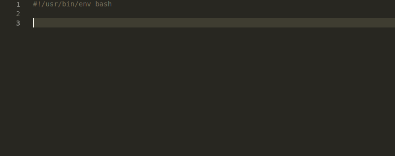

# shellman

Shell script snippet


## Stopwatch example



## `fn... / fx...` example


## Requirements

- vscode
- bashdb (If you need to debug your scripts)

## Usage

Install extionsion in vscode by:

```bash
ext install Remisa.shellman
```

Start typing and Shellman will provide you available commands.

For more convenience similar commands are grouped into same prefixes. Here is an overoview:

`bash`

Shebang should be used as the first line of your script. You can replace `bash` with any other installed scripting language like `node` or `python`.

`cmd...`

Run external commands and check if operation succeeded.

`color...`

Write colorful

`directory...`

Directory operations

`func...`

Snippets related to function.

`for...`

Iterate different collections/arrays...

`file...`

File operations

`format...`

Write in bold, italic, dim, reverse format.

`if...`

Wide range of logical conditions which are more common in bash scripts.

`stopwatch...`

Start and stop, stopwatch and read elapsed time.

## `fn` / `fx`

`fn...`

inserts a whole function into script. Function declaration should prceed its usage.

`fx...`

Call function which is declared by `fn...`

## List of [commands](COMMANDS.md)

## To do

- [x] Write colorful text
- [x] New whole function feature (whole functions start with `fn`)

## Release Notes

### 1.3.0

- stopwatch
- `fn...` / `fx...` whole function and usage insertion.
  - `fn banner simple`: insert function to print a banner.
  - `fn banner color`: insert function to print a color banner.

### 1.2.0

- Check last command success/failure via `cmd...`
- Directory operations via `directory...`

### 1.1.2

- Fixed vscode marketplace header color contrast

### 1.1.1

- Minor bugs fixed
- Write colorful text
- Write formatted text (bold, italic, dim, reverse)
- Snippet documentation added

### 0.0.1

Initial release
